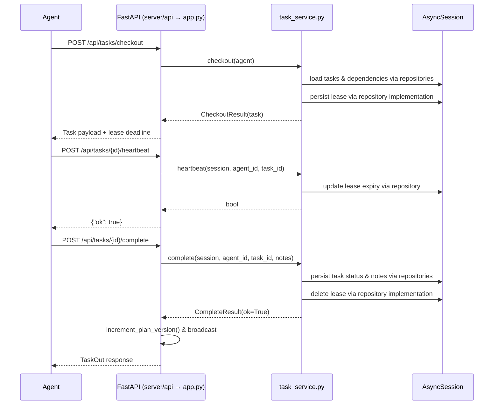

# Switchboard Architecture Overview

Switchboard is a FastAPI-based control plane that coordinates agent tasks and
mirrors live project documents. The system is intentionally lightweight so it
can run in constrained environments while remaining observable.

## Component Responsibilities

| Layer | Source Files | Responsibilities |
| --- | --- | --- |
| API Gateway | `server/api/`, `server/app.py`, `web/` | Hosts REST + WebSocket endpoints, serves the operator UI, and coordinates broadcasting plan updates. |
| Domain & Application | `server/domain/`, `server/application/task_service.py`, `server/file_store.py`, `server/execplan_registry.py` | Encapsulates task lifecycle rules, lease policies, ExecPlan metadata normalization, and live-file orchestration. |
| Persistence | `server/models.py`, `server/db.py`, `server/infrastructure/repositories.py` | Defines SQLAlchemy models (tasks, dependencies, leases, ExecPlan tables), batches dependency lookups through repository adapters, and configures the async engine/session factory. |
| Middleware & Instrumentation | `server/middleware/`, `server/instrumentation/`, `server/settings.py` | Adds request throttling, logging, metrics, and tracing driven entirely by environment variables. |
| Client Tooling | `client/python/`, `switchboard_cli.py` | Provides an opinionated HTTP client and CLI, sharing the `TaskStatus` enum with the server for consistent status handling. |

Every module surfaces a descriptive docstring outlining its role; the table above maps those descriptions to concrete files so new contributors can jump straight to the relevant code path. Repository adapters now prefetch dependency edges in a single query so the `TaskService` checkout flow no longer issues N+1 lookups when scanning the task backlog.

## Core Request Sequences

### Task Checkout & Completion

### Live File Publish

1. Agent uploads content to `PUT /api/files/<path>`.
2. `server/file_store.py` validates the destination path, writes to disk, and stores metadata rows.
3. The FastAPI handler responds with a `FileUploadResponse` containing the canonical public URL (`/live/<path>`).
4. The operator UI and other agents read the updated document directly from `/live/<path>` without re-uploading.

## Persistence Model

The database schema revolves around four primary tables:

- `tasks` — stores title, description, status, and optional completion notes.
- `task_dependencies` — many-to-many table encoding DAG edges (`task_id` → `depends_on_task_id`).
- `leases` — tracks the current agent lease for a task with an expiry timestamp.
- `execplan_registry` / `execplans` — optional tables for capturing curated plan documents alongside task DAGs.

`server/models.py` centralizes the ORM definitions; migrations under `server/migrations/` extend the schema. Runtime helpers (e.g., `lifespan` in `server/api/lifecycle.py`) ensure new deployments apply critical migrations such as the `completed_notes` column.

## Deployment & Configuration

- **Environment-first configuration:** Settings live in `server/settings.py` with explicit validation. `SWITCHBOARD_RATE_LIMIT_*` and `SWITCHBOARD_LEASE_SECONDS` govern throttling and lease durations; `/api/settings` surfaces the active values for verification.
- **Local automation:** `Makefile` targets wrap setup (`make setup`), execution (`make run`), and quality checks (`make qa`). Windows users can rely on the Python helper scripts in `scripts/` for parity.
- **Docker Compose:** `ops/docker-compose.yml` runs the API, applies environment variables from `ops/.env`, and mounts persistent volumes for SQLite and live files. Observability helpers (`ops/logging.ini`, `ops/otel.yaml`) plug directly into the instrumentation modules when enabled.

Refer to [docs/architecture.md](docs/architecture.md) for an even deeper exploration, including CLI interactions, testing boundaries, and operational considerations for multi-agent deployments.
