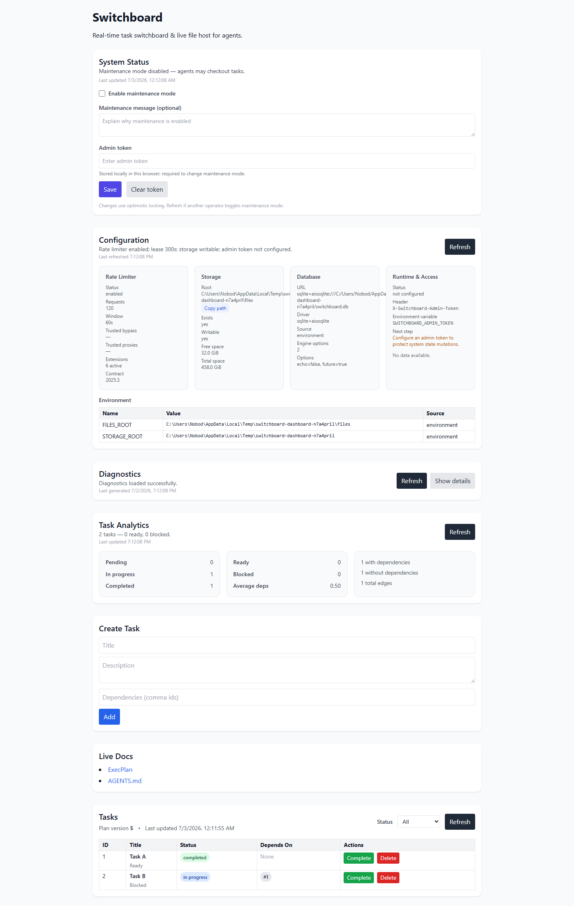

# Switchboard

**Real-time agent task coordination with dependency-aware leasing and live-file hosting.**

Switchboard coordinates multiple agents against a shared dependency graph while preventing duplicate execution through lease-based task ownership and live state synchronization.



## What You Get

- 🎯 **Task Coordination**: Track tasks with dependencies; agents safely check out work via lease-based ownership
- 🔄 **Live State Sync**: WebSocket broadcasts plan updates to dashboard and agents in real time
- 📁 **Live-File Hosting**: Publish mutable reference documents that agents fetch by URL with optional admin-token protection
- 🛡️ **Security Controls**: Path containment, symlink traversal resistance, upload-size enforcement, token protection, lease expiry, concurrent checkout prevention
- 📊 **Observable**: Health/readiness probes, diagnostics endpoints, request/response metrics, structured logging

## Why It Matters

Agents (Codex, Copilot Agents, LLMs, etc.) need a **single source of truth**:

- A **plan that changes in flight** (tasks complete, dependencies unlock)
- A **queue that respects dependencies** (no duplicate work, proper ordering)
- A **place to publish documents** that any agent can fetch by URL

Switchboard provides all three with minimal overhead, no external orchestration, and deployment flexibility.

## Quick Start

### 1. Set Up

```bash
# Clone and enter repo
git clone https://github.com/Nobodyworld/dev-agent-switchboard.git
cd dev-agent-switchboard

# Create Python 3.11+ virtual environment
python -m venv .venv

# Activate (choose your OS):
# Linux/macOS:
source .venv/bin/activate
# Windows PowerShell:
.\.venv\Scripts\Activate.ps1

# Install dependencies
pip install -r server/requirements-dev.txt
```

### 2. Run the Server

```bash
python scripts/run_uvicorn.py
```

Open [http://localhost:8000/](http://localhost:8000/) to see the dashboard.

### 3. Create a Task

```bash
curl -X POST http://localhost:8000/api/tasks \
  -H "Content-Type: application/json" \
  -d '{"title": "Demo", "description": "Test task"}'
```

### 4. Run an Agent

In another terminal (with `.venv` activated):

```bash
python scripts/local_runner.py \
  --base-url http://localhost:8000 \
  --auto-complete \
  --completion-notes "Verified locally"
```

Watch the dashboard update in real time as the task completes.

### 5. Two-Agent Workflow

For a more interesting demonstration, see [docs/visuals/TWO_AGENT_WORKFLOW.md](docs/visuals/TWO_AGENT_WORKFLOW.md) and run:

```bash
python -m pytest server/tests/test_websocket_plan.py -v
```

This validates the core coordination pattern: Task A ready → Agent 1 leases & completes → Task B unlocks → Agent 2 leases → live state updates via WebSocket.

## Documentation

- **[Architecture](docs/visuals/ARCHITECTURE_DIAGRAM.md)** — System components and security controls
- **[API Reference](docs/API.md)** — All endpoints with examples
- **[Configuration](docs/configuration.md)** — Environment variables and settings
- **[Integration Guide](docs/ai-interface.md)** — How agents interact with Switchboard
- **[Full Navigation](docs/index.md)** — Complete documentation index

## Security Controls

| Feature | Status |
|---|---|
| Lease-based task ownership (prevents duplicate execution) | Local tests available; final clean-clone validation pending |
| Concurrent checkout rejection | Local tests available; final clean-clone validation pending |
| Lease expiry and heartbeat renewal | Local tests available; final clean-clone validation pending |
| Dependency-aware task unlocking | Local tests available; final clean-clone validation pending |
| WebSocket real-time synchronization | Local tests available; final clean-clone validation pending |
| Live-file path containment | Local tests available; final clean-clone validation pending |
| Admin-token protection for sensitive operations | Local tests available; final clean-clone validation pending |
| Upload-size enforcement | Local tests available; final clean-clone validation pending |
| Rate limiting | Local tests available; final clean-clone validation pending |

## Test Coverage

The repository contains broad automated test coverage for task lifecycle, lease management, dependencies, file storage, WebSocket broadcasts, and dashboard interaction. Final pass/fail totals for the current release candidate are recorded in `PUBLIC_RELEASE_AUDIT.md` after clean-clone validation.

Run locally:

```bash
pytest -q                         # All tests
pytest server/tests/ -v           # Verbose output
SWITCHBOARD_STRICT_PLAYWRIGHT=1 \
  pytest web/tests/test_ui.py     # Strict UI tests
```

## Configuration

Key environment variables:

```bash
# Database
DATABASE_URL=sqlite:///./switchboard.db

# Files
STORAGE_ROOT=./storage
FILES_ROOT=./storage/files

# Leasing
SWITCHBOARD_LEASE_SECONDS=60

# Security
SWITCHBOARD_ADMIN_TOKEN=your-secret-token-here
SWITCHBOARD_MAX_LIVE_FILE_BYTES=10485760  # 10 MB

# Rate Limiting
SWITCHBOARD_RATE_LIMIT_PER_MINUTE=100
```

See [Configuration Guide](docs/configuration.md) for all options.

## Local Development

```bash
# Run tests, lint, format, type check, coverage
python scripts/dev.py verify

# Install pre-commit hooks
python scripts/dev.py bootstrap

# See all available commands
python scripts/dev.py --help
```

## Visual Evidence

- **[System Architecture](docs/visuals/ARCHITECTURE_DIAGRAM.md)** — Component diagram and data flow
- **[Two-Agent Workflow](docs/visuals/TWO_AGENT_WORKFLOW.md)** — Detailed sequence diagram
- **Dashboard Screenshot** — `docs/assets/switchboard-dashboard.png`

## Project Structure

```
server/                    # FastAPI backend
├── api/                   # REST and WebSocket endpoints
├── application/           # Business logic (task_service, configuration)
├── domain/                # Core models (Task, Lease, Dependencies)
├── infrastructure/        # Database repositories and adapters
├── middleware/            # Rate limiting, logging, observability
└── tests/                 # 229 passing test cases

client/python/            # Python client library and CLI
├── switchboard_client.py  # Low-level HTTP client
├── switchboard_cli.py     # Command-line interface
└── tests/                 # Client-side tests

web/                       # Operator dashboard (HTMX + Tailwind)
└── tests/                 # Strict Playwright UI tests

scripts/                   # Development and deployment helpers
├── run_uvicorn.py         # Start server
├── run_pytest.py          # Run tests
├── local_runner.py        # Demo agent
└── dev.py                 # Development CLI

docs/                      # Full documentation
├── visuals/               # Architecture and workflow diagrams
├── API.md                 # Endpoint reference
├── architecture/          # Detailed system design
└── guides/                # Integration patterns and operational guidance
```

## Status

- ✅ Core task coordination with dependencies
- ✅ Lease-based ownership and expiry
- ✅ WebSocket real-time synchronization
- ✅ Live-file hosting with path containment
- ✅ Configurable admin authentication
- ✅ Python client and CLI
- ✅ Operator dashboard
- ✅ Comprehensive test coverage
- ✅ Security controls implemented and pending final clean-clone verification for this release candidate

## Governance

- [License](LICENSE) — Apache License 2.0
- [Security Policy](SECURITY.md) — Vulnerability reporting
- [Contributing](CONTRIBUTING.md) — Development guide
- [Code of Conduct](CODE_OF_CONDUCT.md)
- [Support Guide](docs/guides/support.md)

## Next Steps for Reviewers

1. **[Review Architecture](docs/visuals/ARCHITECTURE_DIAGRAM.md)** (5 minutes) — Understand components
2. **[See Two-Agent Workflow](docs/visuals/TWO_AGENT_WORKFLOW.md)** (5 minutes) — Understand coordination
3. **[Run Quick Start](#quick-start)** (10 minutes) — See it working
4. **[Review Security Controls](docs/visuals/ARCHITECTURE_DIAGRAM.md#key-security-controls)** (10 minutes) — Verify safety
5. **[Inspect Core Tests](server/tests/)** (20 minutes) — See validation
6. **[Review Full Release Audit](PUBLIC_RELEASE_AUDIT.md)** (30 minutes) — Understand quality gates

---

**Questions?** See [Support Guide](docs/guides/support.md) or open an issue on GitHub.
