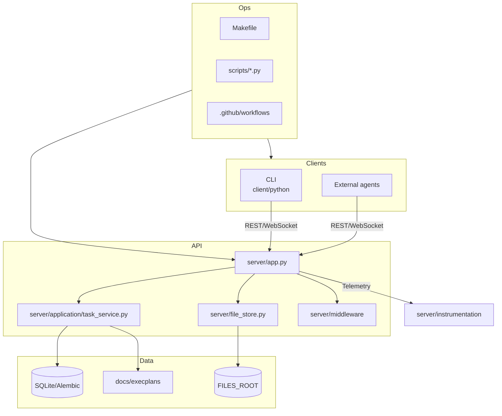

# Switchboard Repo Intelligence Report

_Last updated: 2025-02-15_

> **Executive Snapshot**
> - Switchboard coordinates autonomous coding agents through a FastAPI backend, HTMX operator console, and Python SDK/CLI.
> - Operational maturity is uneven: governance and CI guardrails exist but are permissive, typing is partial, and observability is nascent.
> - Highest-value investments: rebuild CI + security scanning, enforce strict typing, replace runtime schema mutations with migrations, and formalize developer onboarding.

## System Overview

### Domain & Responsibilities
| Domain | Responsibilities | Primary Modules |
| --- | --- | --- |
| **Task Orchestration** | Manage agent registration, task checkout, heartbeats, completion/abandon, dependency unlocking. | `server/app.py`, `server/application/task_service.py`, `server/models.py`, `server/schema.py` |
| **Plan Registry & Broadcasting** | Persist DAG versions, stream WebSocket updates, expose historical ExecPlans. | `server/application/task_service.py`, `server/execplan_registry.py`, `server/app.PlanBroadcaster` |
| **File Mirroring** | Accept live file uploads, write to disk, serve via `/live/*` with optional ETag helpers. | `server/file_store.py`, storage directories under `FILES_ROOT` |
| **Operator UI** | Render HTMX/Tailwind dashboard for plan/task inspection with live updates. | `web/index.html`, `web/static/` |
| **Client Integrations** | Python SDK + CLI for autonomous/human agents, heartbeat threads, retries. | `client/python/switchboard_client.py`, `client/python/switchboard_cli.py`, root shims |
| **Tooling & Ops** | Bootstrap scripts, Make targets, Docker Compose, instrumentation wiring. | `Makefile`, `scripts/*.py`, `ops/docker-compose.yml`, `server/instrumentation/` |

### Component Inventory
| Component | Description | Ownership Notes |
| --- | --- | --- |
| `server/` | FastAPI application, SQLAlchemy ORM models, instrumentation glue. | Needs module boundaries, ownership split between API, task engine, instrumentation. |
| `client/python/` | Installable SDK and CLI entry points. | Duplicated by root-level shims; clarify deprecation policy. |
| `web/` | HTMX/Tailwind dashboard assets and templates. | Build pipeline absent; adopt Prettier/Tailwind lint to prevent drift. |
| `ops/` | Docker Compose, deployment manifests. | Ensure Compose reflects production topology; currently SQLite-only. |
| `scripts/` | Utility scripts for running services/tests. | Some scripts stale (e.g., `run_pytest.py` vs Make targets); evaluate consolidation. |
| `docs/` & `REPORTS/` | ADRs, migration notes, archival reports. | Deduplicate authoritative sources vs. historical artifacts. |

### Data Flows
1. **Agent lifecycle** — `POST /api/agents` registers clients, returning lease cadence; `POST /api/tasks/checkout` issues work conditioned on dependencies stored in `tasks`/`task_dependencies` tables; `POST /api/tasks/{id}/heartbeat` extends leases; `POST /api/tasks/{id}/complete` records completion and increments plan version.
2. **Plan broadcasting** — Mutations call `increment_plan_version()` and push payloads through `PlanBroadcaster` to `/ws/plan`; UI subscribes for live state.
3. **File hosting** — `PUT /api/files/{path}` writes content to `FILES_ROOT`; downloads served via `/live/<path>` with optional ETag/Last-Modified.
4. **Operator UI** — `GET /` renders template with plan snapshot; HTMX fragments hit `/api/plan` and subscribe to WebSocket for deltas.
5. **ExecPlan registry** — `GET /api/plan` returns active DAG; `GET /api/plan/{version}` or docs endpoints expose archived plans from `docs/execplans/`.

### Public Surfaces
- **REST API**: `/api/agents`, `/api/tasks`, `/api/plan`, `/api/status`, `/api/files`.
- **WebSocket**: `/ws/plan` for plan snapshots/version deltas.
- **Static UI**: root index + `/static/*` assets.
- **CLI / SDK**: `switchboard_cli.py`, `switchboard_client.py`, package `client/python`.
- **Scripts & Jobs**: `scripts/run_uvicorn.py`, `scripts/run_pytest.py`, Make targets (`make run`, `make qa`). No long-running background workers; lease pruning is synchronous in request handlers.

### Data Stores & External Services
| Store / Service | Usage | Notes |
| --- | --- | --- |
| SQLite (default) | Primary relational store for tasks, plans, leases. | Alembic in place but runtime still performs manual DDL on startup. |
| Filesystem (`FILES_ROOT`) | Mirrors uploaded artifacts and live ExecPlan docs. | Needs quota limits and periodic pruning strategy. |
| WebSockets (in-process) | Push plan updates to operators/agents. | Implemented via FastAPI `WebSocket` with naive broadcast; lacks backpressure controls. |
| Prometheus endpoint (scaffold) | Exposes metrics when instrumentation is enabled. | Needs validation, default disabled. |
| External APIs | None by default; clients interact directly with server. | Future integrations should pass through typed gateways.

### Deployment & Environment Matrix
| Environment | Status | Notes |
| --- | --- | --- |
| Local development | Supported via `make run`, SQLite, `.env` overrides. | Requires manual dependency installation; no bootstrap script. |
| CI (GitHub Actions) | Single Python version, lint/test matrix minimal. | Needs caching, SBOM, artifact retention. |
| Production (assumed) | Not codified; Compose suggests containerized FastAPI + SQLite. | Define IaC + runtime expectations before release automation.

## Tech Stack & Dependency Map

- **Languages**: Python 3.11, HTML/JS (HTMX), YAML/TOML configs.
- **Frameworks/Libraries**: FastAPI, Starlette, SQLAlchemy (async), Alembic, Jinja2, HTTPX/Requests, Pydantic v1, Prometheus/OpenTelemetry instrumentation scaffolding, Ruff, Black, Pytest, Bandit.
- **Tooling**: GitHub Actions (`ci.yml`, `commitlint.yml`), Renovate (`renovate.json`), pre-commit, Makefile automation, Docker/Compose, commitlint.

### Hotspots & Potential Dead Code
- **`server/app.py` monolith** — ~800 LOC mixing API routes, templating, WebSocket state, startup migrations. Break into routers + app factory with explicit dependency graph.
- **Runtime schema mutations** — Startup lifespan executes raw `ALTER TABLE` for `completed_notes`; replace with Alembic revision and migration smoke test.
- **Mutable global config** — Rate limit middleware caches env-derived settings globally; tests manipulating env vars may leak state between runs.
- **Client shims duplication** — Root `switchboard_client.py`/`switchboard_cli.py` mirror package entry points; plan staged deprecation with import compatibility layer.
- **Legacy artifacts** — `REPORTS/` and older scripts appear archival; verify references prior to pruning to avoid breaking governance audit trails.
- **Instrumentation guards** — Optional logging/metrics modules rely on `try/except ImportError`; provide typed fallbacks to eliminate hidden failures.
- **UI asset drift** — Tailwind/HTMX assets lack build validation; add Prettier/ESLint/Stylelint to catch regressions.

## Risks & Quick Wins

| Area | Risk | Suggested Mitigation | Effort | Impact |
| --- | --- | --- | --- | --- |
| Governance | Inconsistent contribution guidance; lack of CODEOWNERS enforcement in reviews. | Refresh governance docs, CODEOWNERS, templates, align README links. | Low | High |
| CI/CD | Workflow lacks matrix/cache; coverage artifacts missing. | Rebuild `ci.yml` with Py311/312 matrix, caching, coverage upload, gating. | Medium | High |
| Typing | `mypy` not strict; `type: ignore` scattered. | Enable `mypy --strict`, remediate top offenders via staged PRs. | Medium | High |
| Security | No SBOM generation; upload API unbounded. | Add gitleaks/trivy/pip-audit, enforce file size/type limits with config toggles. | Medium | High |
| Observability | Logging/tracing optional; metrics endpoint untested. | Introduce structured logging middleware, health/metrics tests. | Medium | Medium |
| DX | Multiple entrypoints; docs drift; bootstrap unclear. | Provide `make bootstrap`, align docs, add first-hour guide. | Low | Medium |
| Data | Runtime DDL indicates migration debt. | Replace with Alembic revision + migration smoke tests. | Low | High |
| Testing | WebSocket/CLI flows lack integration coverage. | Build pytest markers + CLI/WebSocket integration tests. | Medium | High |
| Performance | Broadcast loop lacks backpressure; DB indices minimal. | Add async broadcast queue, index migrations, performance benchmarks. | Medium | Medium |
| Reliability | Missing readiness checks and graceful shutdown hooks. | Add `/readyz` + signal handling, test with orchestrated shutdowns. | Medium | Medium |

## Top 10 Opportunities by ROI

| Rank | Opportunity | Why It Matters | Dependencies |
| --- | --- | --- | --- |
| 1 | **Governance & Policy Baseline** | Prevents process drift, enables CODEOWNERS enforcement, aligns contributors. | None |
| 2 | **CI Rebuild with Caching & Coverage** | Gives deterministic feedback, reduces feedback loop cost, prerequisites for future gating. | Task M1.TOOL.1/2 |
| 3 | **Strict Typing Initiative** | Shrinks runtime defect surface, unlocks safer refactors. | CI rebuild |
| 4 | **Runtime Migration Cleanup** | Eliminates startup race conditions, supports multi-node deploys. | Typing initiative |
| 5 | **Configuration Schema Validation** | Hardens config boundaries, improves DX. | Governance baseline |
| 6 | **Security Scanning & SBOM** | Provides supply-chain assurance and audit trail. | CI rebuild |
| 7 | **Observability Consistency** | Enables triage, ensures SLO monitoring readiness. | App modularization |
| 8 | **Test Pyramid Expansion** | Gives confidence across CLI/WebSocket flows, supports release automation. | CI rebuild |
| 9 | **Performance Guardrails** | Shields operators from cascading failures, informs capacity planning. | Observability instrumentation |
| 10 | **DX Improvements** | Reduces onboarding friction, codifies workflows. | Governance baseline |

## Additional Observations
- README, ARCHITECTURE.md, and MIGRATION.md partially overlap with REPORT/PLAN; consolidate into canonical architecture + operational guides to avoid drift.
- Observability scaffolding exists but lacks explicit configuration tests — instrumentation modules should expose typed factories and fail fast when optional deps missing.
- STATUS.md must be updated after every PR with summary + next steps per directive.
- Introduce ADRs for architectural shifts (e.g., app factory, settings system) to capture rationale and keep modernization traceable.
