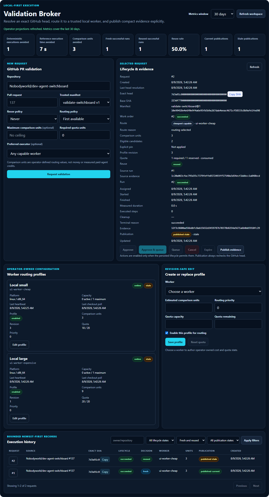

# Validation command center

The **Validation Broker** workspace turns the existing trusted execution APIs
into one operator workflow. It remains a public developer preview for localhost
or controlled trusted networks; it is not a hosted execution service, remote
shell, provider router, or billing dashboard.

The screenshot was captured from the offline browser acceptance application
using synthetic repository, SHA, worker, route, quota, evidence, and publication
data. It contains no admin token, credential-shaped value, local path, machine
identity, private URL, or claim of actual financial savings.

## Operator workflow

1. Start Switchboard and at least one configured outbound local worker. Keep the
   worker's heartbeat and checkout-poll intervals inside the server freshness
   windows.
2. Open the dashboard and, when configured, enter the existing admin token in
   the dashboard's settings. The browser keeps it in local storage and attaches
   it to protected requests using the accepted `Authorization: Bearer` form;
   the server never returns it to the workspace.
3. Create or edit an operator-owned worker routing profile. Profile replacement
   and quota reset require the latest revision. A `409` refreshes visible state
   and leaves a persistent recovery message instead of overwriting newer data.
4. Enter an allowlisted `owner/repository`, pull-request number, trusted manifest,
   reuse policy, routing policy, optional maximum comparison units, required
   quota, and optional hard worker pin.
5. Request validation. Switchboard resolves the authenticated actor and the
   exact current PR head, then creates or returns one pending work order whose
   complete execution policy participates in adapter idempotency.
6. Inspect the exact SHA and explicitly approve and queue the request. Approval
   is never implied by request creation.
7. Allow the outbound worker to claim the job. The selected request is polled
   while active; selecting another request replaces the timer.
8. Inspect the queued route assessment or persisted terminal route, quota state,
   candidate count, profile revision, run timestamps and duration, fresh/reused
   decision, reused source provenance, cleanup, compact evidence fingerprint,
   and publication decision.
9. Explicitly publish evidence. Switchboard re-resolves the PR head immediately;
   a moved head is labelled stale without rewriting the tested SHA.
10. Use bounded history and filters to review prior requests. Copy actions expose
    only stable IDs, exact SHAs, and compact fingerprints already present in the
    projection.

Disabled actions remain visible and provide a reason. The workspace supports
keyboard navigation and collapses to one column at narrow widths without page
horizontal overflow.

## Manual acceptance

On an offline development instance, register two synthetic trusted workers and
give them enabled profiles with different comparison-unit values. Submit a
`never` plus `cheapest_capable` request, approve and queue it, and confirm the
lower-cost eligible worker is selected. Complete and publish it, then submit the
same exact validation identity with `allow_exact`; confirm a distinct request
produces a distinct reused run with no executed validation steps. Move the mocked
PR head and publish again; the second record must become stale while the tested
SHA remains unchanged. Finally, filter history to reused rows, force one stale
profile revision, tab through the request form, and verify both a desktop and a
390-pixel viewport have no page-level horizontal overflow. The automated strict
browser regression performs this procedure with a file-backed database and no
network or real GitHub credential. Its completion endpoint is deliberately a
synthetic UI fixture; it does not claim to prove worker-local execution or
cryptographic reuse verification. That trust path is separately exercised by
the file-backed `ExecutionClient`/`LocalWorker` acceptance in
`client/python/tests/test_execution_worker_server_smoke.py`, which runs the
trusted manifest once, retains evidence, verifies the exact retained source on
the worker, and skips the step runner only for the reused run.

## Projection and identity contract

The workspace reads four authenticated projections:

- `GET /api/execution/operator/overview?window_days=30`
- `GET /api/execution/operator/history?limit=25&offset=0`
- `GET /api/execution/workers?limit=100&offset=0`
- `GET /api/execution/github/requests?limit=25&offset=0`

Limits are at most `100`, offsets at most `10000`, and metric windows at most
`365` days. History is newest-first with stable ID tie-breaking and one latest
run per request. Filters cover repository, lifecycle, fresh/reused decision, and
publication state. Projection responses exclude commands, argv, full logs,
environment dumps, credentials, local paths, candidate lists, and complete
worker capabilities.

The selected request uses the existing bounded route-assessment and run-detail
APIs. Before assignment it displays the selected candidate, abstract comparison
units, eligible count, bounded reason, and hard-pin decision. After assignment it
displays persisted worker/profile provenance, required and reserved quota,
reservation state, timestamps, measured duration, reuse source identity,
evidence fingerprint, cleanup, and terminal state. Missing values are displayed
as unavailable rather than inferred. Worker cards separately show declared
status, server-derived activity, safe OS/architecture, active/max capacity,
heartbeat and checkout-poll timestamps, and operator-owned profile state.

The request idempotency identity includes repository, stable PR identity, exact
head, trusted manifest, authenticated actor, reuse policy, routing policy,
maximum comparison units, required quota, and preferred executor. Requests with
different policy do not collapse. For an all-default request only, Switchboard
also checks the exact pre-command-center key so existing adapter rows keep their
request and work-order identities without mutation. Policy is stored
authoritatively on the linked work order; the adapter schema needs no new policy
columns or migration.

## Metrics

The overview is derived from persisted database records for the selected window:

- **Deterministic executions avoided** counts successful reused runs only.
- **Reference execution time avoided** sums the persisted `finished_at - started_at`
  duration of each linked successful source run when both timestamps are valid.
- **Comparison units avoided** sums the reused run's persisted route estimate
  when present.
- **Fresh successful runs**, **reused successful runs**, and **reuse rate** use
  terminal successful runs only; the rate denominator is their sum.
- **Current** and **stale publications** use persisted publication state.

Missing source duration or route cost contributes nothing rather than an
estimate. A source run is not itself counted as avoided. Comparison units are
operator-defined local routing values, not currency, paid-agent credits,
provider usage, actual spend, or measured savings.

## Recovery and limitations

- An empty projection is a valid state; configure a worker/profile and create a
  request rather than treating it as a server failure.
- A stale profile revision returns `409`. Reload the profile and deliberately
  reapply the intended values.
- Cheapest-capable routing still requires fresh heartbeat, active polling,
  capacity, capabilities, network/read-only compatibility, an enabled profile,
  cost within the optional ceiling, and sufficient quota.
- Exact reuse remains same-worker and requires local retained evidence proof.
  `allow_exact` falls back to fresh execution; `require_exact` never validates
  when proof is unavailable.
- The GitHub adapter resolves identity and publishes a managed comment but does
  not fetch source. The exact commit must already exist in the worker's approved
  canonical checkout.
- Full logs and artifact bytes remain under the worker-owned evidence root. The
  browser receives compact evidence only.
- There is no MCP, paid-agent, provider, browser-worker, desktop/RPA, webhook,
  auto-approval, auto-publication, or production multi-tenant scope in this slice.

See [Local worker operations](local-worker.md),
[GitHub exact pull-request validation](github-exact-pr-validation.md), and the
[execution API reference](../API.md) for the underlying contracts.
