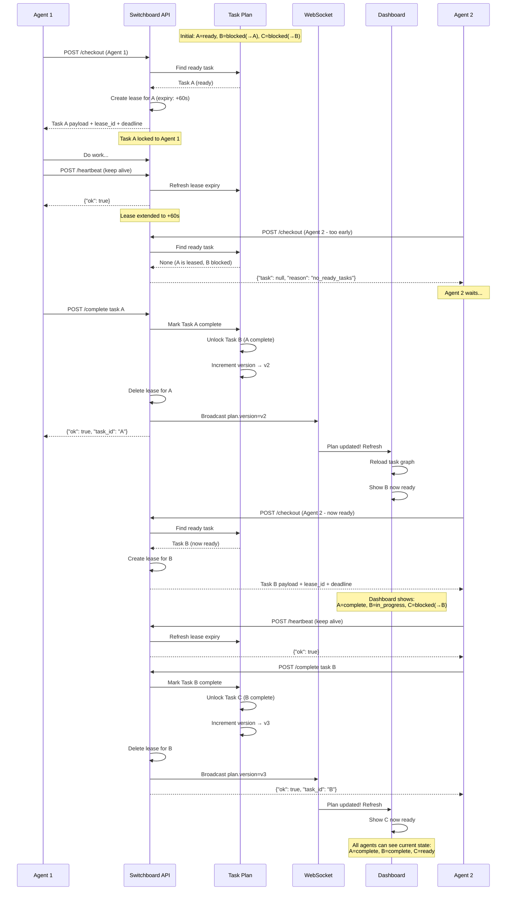

# Two-Agent Workflow Sequence

This diagram shows the core Switchboard coordination pattern: how two agents safely work on dependent tasks through lease-based ownership and live state synchronization.

## Scenario

**Initial State:**
- Task A: "Prepare data" → ready (no dependencies)
- Task B: "Process results" → blocked (depends on Task A)
- Task C: "Report" → blocked (depends on Task B)

## Execution Flow

## Key Guarantees

| Guarantee | How Enforced |
|-----------|---|
| **Only one agent works on a task** | Checkout creates an exclusive lease; concurrent attempts fail |
| **Agent must keep heartbeat** | Lease expires if heartbeat stops; other agents can reclaim task |
| **Tasks unlock correctly** | Completion marks task done and checks dependents; DAG ensures proper ordering |
| **Dashboard stays in sync** | WebSocket broadcasts plan.version; clients refresh state |
| **No split-brain** | Single database source of truth; all agents read from same server |

## Test Coverage

- Regression tests: [server/tests/test_task_lifecycle.py](../../server/tests/test_task_lifecycle.py)
- WebSocket plan broadcasts: [server/tests/test_websocket_plan.py](../../server/tests/test_websocket_plan.py)
- UI state sync: [web/tests/test_ui.py](../../web/tests/test_ui.py)

---

This pattern scales to N agents and arbitrary dependency graphs. The lease mechanism prevents duplication, and the broadcast ensures coordination without polling.
